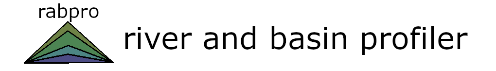

<a href='https:///VeinsOfTheEarth.github.io/rabpro/'></a>

[](https://pypi.org/project/rabpro/) [](https://github.com/psf/black) [](https://anaconda.org/jschwenk/rabpro) [](https://github.com/VeinsOfTheEarth/rabpro/actions/workflows/build.yaml)

> Package to delineate watershed subbasins and compute attribute statistics using [Google Earth Engine](https://developers.google.com/earth-engine/).

## Setup

|[Software installation](https://veinsoftheearth.github.io/rabpro/install/index.html)|[Data configuration](https://veinsoftheearth.github.io/rabpro/configure/index.html#data)|[Software configuration](https://veinsoftheearth.github.io/rabpro/configure/index.html#software)|
|--|--|--|

## Usage

> See Example notebooks:

|[Basic workflow](https://veinsoftheearth.github.io/rabpro/examples/notebooks/basic_example.html)|[Full workflow](https://veinsoftheearth.github.io/rabpro/examples/notebooks/full_example.html)|[Basin stats examples](https://veinsoftheearth.github.io/rabpro/examples/notebooks/basin_stats.html)|
|--|--|--|

## Citation

The following text is the current citation for rabpro:

> Zussman, T., J. Schwenk, and J. Rowland. River and Basin Profiler: A Module for Extracting Watershed Boundaries, River Centerlines, and Catchment Statistics. Other. Hydrology, December 30, 2021. <https://doi.org/10.1002/essoar.10509912.1>.

## Development

### Testing

```python
python -m pytest
```

### Local docs build

```shell
cd docs && make html
```
